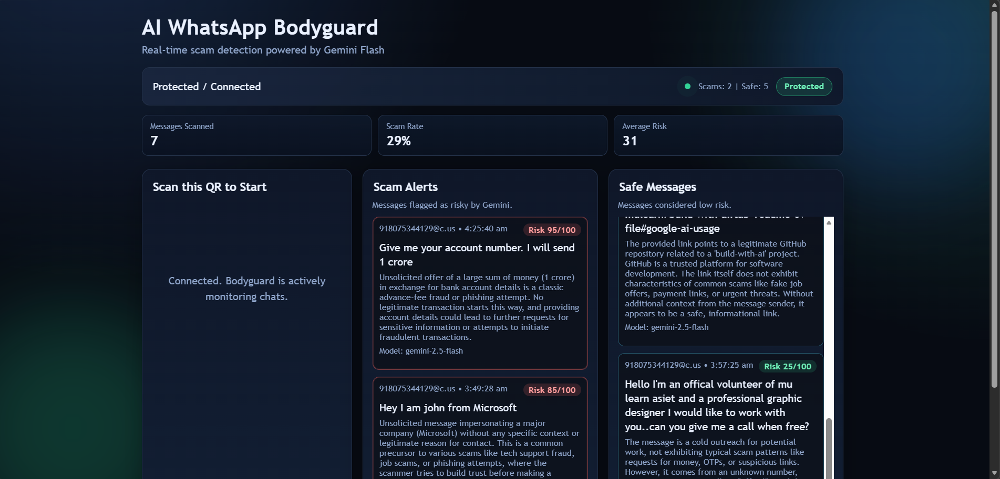

# AI WhatsApp Bodyguard

## Problem Statement

WhatsApp is a primary vector for scam messages targeting users with OTP theft, phishing attempts, fake job offers, UPI payment fraud, unsolicited money offers, and urgent account security threats. Users struggle to identify and respond to these threats in real-time, leading to financial loss and data compromise. There is an urgent need for an intelligent, real-time scam detection system that automatically identifies threats and alerts users.

## Project Description

**AI WhatsApp Bodyguard** is a real-time scam detection system that monitors incoming WhatsApp messages using advanced AI and responds intelligently to threats. The application:

- **Monitors Messages in Real-Time**: Integrates seamlessly with WhatsApp Web to capture all incoming messages
- **Detects Scams with AI**: Uses Google Gemini Flash (with automatic fallback to local rules engine) to classify messages as scams or safe
- **Auto-Replies to Scammers**: Automatically sends cautionary replies to detected scam senders
- **Self-Alerts User**: Sends direct WhatsApp messages to the user's own chat with details of detected threats
- **Live Dashboard**: Real-time web dashboard showing message statistics, scam alerts, safe messages, and connection status
- **Connection Health Monitoring**: Continuously monitors WhatsApp connection state with 8-second health checks
- **Message Deduplication**: Prevents duplicate message processing using 30-minute TTL backend cache and 500-item frontend cache

The system uses a **hybrid approach**:
1. **Primary**: Google Gemini 2.5 Flash for AI-powered scam classification
2. **Fallback**: Local rule-based engine with 10 scam patterns (OTP, UPI, account threats, KSEB bills, job scams, payment pressure, lures, channel shifts, urgency, suspicious links) and 3 combo boosters for accuracy

## Google AI Usage

### Tools / Models Used
- **Google Generative AI SDK**: @google/generative-ai (v0.24.1)
- **Primary Model**: Gemini 2.5 Flash
- **Fallback Models**: Automatic discovery of available Flash variants (gemini-2.5-flash, gemini-2.5-flash-image, gemini-2.0-flash, gemini-1.5-flash)

### How Google AI Was Used

The application integrates Google Gemini AI in the following ways:

1. **Message Analysis Pipeline**:
   - Each incoming WhatsApp message is sent to Gemini 2.5 Flash with a scam classification prompt
   - Gemini returns a risk assessment and reasoning
   - Result: `{ isScam: boolean, riskScore: 0-100, reason: string, modelUsed: string }`

2. **Automatic Model Discovery**:
   - On startup, the app queries Google's Generative AI API endpoint: `v1beta/models`
   - Automatically discovers all available Flash models the API key has access to
   - Scores and selects the best available variant (2.5 > 2.0 > 1.5, with penalties for lite/preview versions)

3. **Intelligent Fallback**:
   - If Gemini API is unavailable or quota-exceeded, system gracefully falls back to local rule-based detection
   - Local rules engine provides reliable scam detection even without API access
   - Users never see API errors; system always returns a scam classification

4. **Real-Time Dashboard Integration**:
   - Gemini analysis results are instantly broadcast to the web dashboard via Socket.IO
   - Display includes: message sender, risk score, Gemini's reasoning, and detection time

### Architecture

**Backend (Node.js + Express)**:
- Socket.IO server for real-time dashboard communication
- WhatsApp client integration using whatsapp-web.js
- Message deduplication with 30-minute TTL
- Gemini API caller with automatic model discovery
- Connection health monitor (8-second interval checks)
- Self-alert message composer for user notifications

**Frontend (Vanilla JavaScript)**:
- Real-time animated dashboard with drift background effects
- Live status indicator with pulsing animation
- Message feed (Scam Alerts | Safe Messages) with revealUp animations
- Live statistics cards: Messages Scanned, Scam Rate %, Average Risk
- Message deduplication (500-item cache limit)
- Socket.IO listener for status, QR, and security logs

## Proof of Google AI Usage

Screenshots demonstrating Google Gemini integration are provided in the `/proof` folder:

### Screenshots

**Screenshot 1: Dashboard Connection State**

- Shows the initial dashboard state waiting for WhatsApp QR authentication
- Displays all metric cards and layout

**Screenshot 2: Live Scam Detection in Action**

- Live dashboard with 7 messages scanned (29% scam rate, average risk 31/100)
- **Scam Alert Examples**:
  - High-risk OTP/account threat (Risk 95/100) detected by Gemini
  - Job impersonation scam (Risk 85/100) classified as malicious
- **Safe Messages**: Legitimate GitHub notification classified as low-risk
- **Model Used**: Shows "gemini-2.5-flash" in results
- **Connection Status**: "Protected / Connected" with live green indicator
- **Auto-Reply**: System has automatically replied to scammers with safety warnings
- **Self-Alert**: User received WhatsApp message about detected threats

**Demo video**
https://drive.google.com/drive/folders/17eSW4Q34tTUWx01nFhw6ZpmM6C1OIqoN?usp=sharing

### Installation Steps

```bash
# Clone the repository
git clone https://github.com/Joel-Jose-Idiculla/mulearn-hackathon.git

# Go to project folder
cd mulearn-hackathon

# Install dependencies
npm install

# Create .env file from example
cp .env.example .env

# Add your Google Gemini API key to .env
# GEMINI_API_KEY=your_api_key_here

# Start the application
npm start

# Open dashboard
# Navigate to http://localhost:3000 in your browser
# Scan the QR code with WhatsApp to authenticate
```

## Features

✅ Real-time WhatsApp message monitoring
✅ Google Gemini 2.5 Flash AI scam classification  
✅ Automatic local fallback detection (never fails)
✅ Auto-reply to detected scams
✅ Self-alert messages to user's own WhatsApp chat
✅ Live web dashboard with animations
✅ Connection health monitoring
✅ Message deduplication (30-min TTL + 500-item frontend cache)
✅ 10 local scam patterns + 3 combo detection boosters

## Technologies

- **Backend**: Node.js, Express, Socket.IO
- **WhatsApp**: whatsapp-web.js v1.34.6
- **AI**: Google Generative AI SDK v0.24.1 (Gemini 2.5 Flash)
- **Frontend**: HTML5, Vanilla JavaScript, CSS3 animations
- **Deployment**: Local development (extensible to cloud)

## Environment Variables

```
GEMINI_API_KEY=your_google_gemini_api_key
GEMINI_MODEL=gemini-2.5-flash
```

## Notes

- WhatsApp authentication persists using LocalAuth strategy
- Message IDs are deduplicated to prevent triple-processing after device switches
- Gemini model is automatically discovered; you don't need to specify exact version
- If Gemini quota is exceeded, the local rules engine provides reliable fallback
- Self-alerts sent only when a scam is detected and user is authenticated
- Health checks ensure connection status is always accurate
